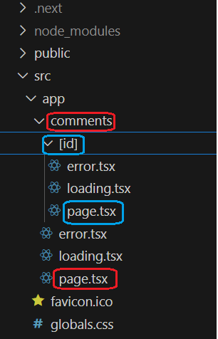
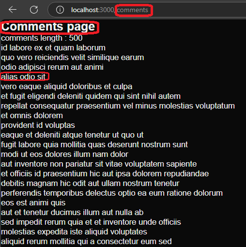
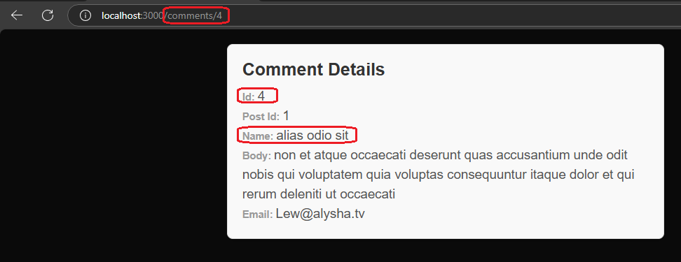

<h1>Project Name</h1>
<p>Next.js Server Components with Dynamic Routing</p>

<h2>Project Description</h2>
<p>This is a Next.js App Router that uses server components to display comments and comment details. Both are fetched from the JSONPlaceholder API. The comment details page is accessed via dynamic routing. The <code>error.tsx</code> file handles error states, and the <code>loading.tsx</code> file manages loading states.</p>

<h2>Motivation</h2>
<p>If you have an app router project with items that include data and an id, and you want to access the details of an item, this repository will answer the following questions:</p>
<ul>
  <li>How do you do it using the app router?</li>
  <li>Is it different for server components compared to client components?</li>
  <li>Is it easier in the app router relative to the pages router?</li>
</ul>


<h2>Installation</h2>

To install all dependencies, run:

```ts
pnpm i
``` 

Alternatively, you can use npm:


<h2>Usage</h2>
Run the devlopment server using

```bash
npm run dev
```


<h2>Code Structure</h2>

<h3>Relevant Folder Tree</h3>
<p>You can see in the following image, the comments folder (in red) with <code>page.tsx</code> and the details folder (in blue) with <code>page.tsx</code></p>




<h3>Navigate to Details Page</h3>
<p>Navigate from the Comments page to the comment details via its id:</p>

```ts
 const res = await axios.get<IComment[]>(COMMENTS_URL);
  const comments: IComment[] = res.data;
  const elems = comments.map((it) => (
    <div key={it.id}>
      <Link href={`${PageUrl.comments}/${it.id}`} >
        {it.name}
      </Link>
    </div>
  ));
```

<h3>Consume Details Comment ID</h3> 
<p>Consume the id via the params. Notice that the <code>id</code> in <code>IProps</code> MUST be the same as in the folder <code>[id]</code>. <code>CommentDetails</code> is a server component, so you can retrieve params very elegantly using <code>await</code>:
</p>


```ts
interface IProps {
  id: string;
}

const CommentDetails = async ({ params }: { params: Promise<IProps> }) => {
  const { id } = await params;
  const commentUrl = `${COMMENTS_URL}/${id}`;
  const res = await axios.get<IComment>(commentUrl);
  const comment: IComment = res.data;
  ...
```

<h2>Demo</h2>

<h3>Comments Page</h3>
<p>The following image shows the comments fetched from JSONPlaceholder rendered to the page. Click on a text line to navigate to the matching details page.</p>



<h3>Comment Details Page</h3>
<p>The following image shows the details of the fourth comment. Simply click on the text 'alias odio sit' from the comments page to navigate to the details page via dynamic routing.</p>




<h2>Points of Interest</h2>

<h3>Client Component vs. Server Component</h3>

Using a client component as the details page, you will use:

```ts
const router = useRouter();
  const { id } = router.query;
```

Here, you cannot enforce the type of <code>id</code>. In a server component, this problem does not exist because you have:

```ts
const CommentDetails = async ({ params }: { params: Promise<IProps> }) => {
  const { id } = await params;
```

The type of <code>id</code> is enforced by <code>IProps</code>, making server components better in this respect. Additionally, server components are much easier than client components in terms of error and loading states—simply use the <code>error.tsx</code> and <code>loading.tsx</code> files.</li> </ul>

<h3>App Router vs. Pages Router</h3> <p>Using the Pages router, you will use a file for dynamic routing (e.g., <code>[id].tsx</code>). However, using the App router, you use a folder (e.g., <code>[id]</code>) and place <code>page.tsx</code> inside it.</p>
